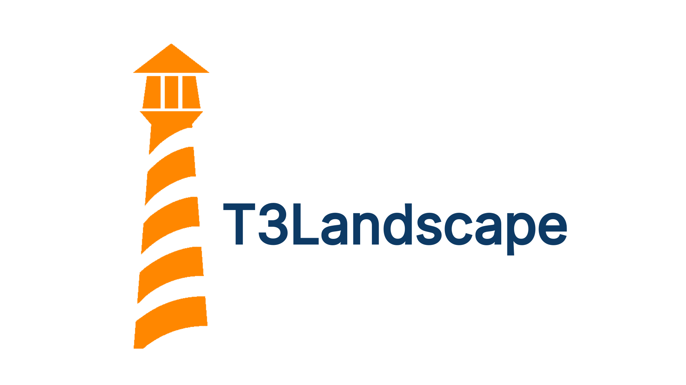

# T3Landscape

**T3Landscape** is an open platform for everyone who wants to explore, understand, and actively shape the TYPO3 ecosystem. From newcomers to long time community members and experts, T3Landscape provides a central place to get a structured and transparent overview of the entire TYPO3 landscape.

As an open source, community driven project, T3Landscape focuses on the neutral and transparent classification of key parts of the TYPO3 ecosystem. This includes community initiatives, extensions, agencies, partners, trainers, and other relevant actors. All evaluations are based on clearly defined criteria that are created and maintained by the community itself. The goal is not to create rankings, but to provide orientation, comparability, and a shared reference framework.

For experts and experienced community members, T3Landscape offers clear added value. It helps identify trends, focus areas, and gaps within the ecosystem, supports strategic decision making, and creates a common language for discussions about quality, sustainability, and future development. At the same time, it makes long term contributions, engagement, and expertise within the TYPO3 community more visible.

T3Landscape enables a fast and effective overview while consistently linking to the original sources. This ensures transparency and allows users to dive deeper into the topics that matter most to them, based on reliable and verifiable information.

As a true community project, T3Landscape lives from participation. Everyone is invited to contribute content, help define and improve evaluation criteria, and actively shape the platform. Together, we are building an open, independent, and sustainable knowledge landscape for the TYPO3 ecosystem.

More details and upcoming features will be announced soon.
